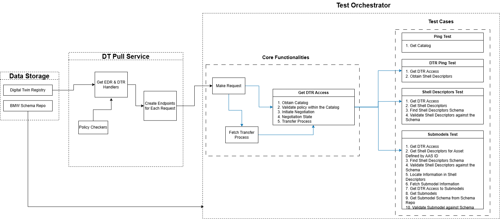

# Documentation for Test Orchestrator Application

## 1. Overview
The Test Orchestrator Application is a FastAPI-based service designed to validate and test data returned by the DT Pull Service. It incorporates features for JSON validation, error handling, and health monitoring, making it an essential component for Catena-X access testing.

### Visual Overview
The below diagram shows how different components interact with each other, as well as with the underlying data storage.



## 2. Key Features
Testing Endpoints: Runs validation tests on data retrieved from the DT Pull Service.

Health Monitoring: A /health endpoint to check application availability (Useful in Kubernetes deployment).

Error Handling: Custom error classes and exception handlers.

JSON Validation: Functions to validate JSON structures against predefined schemas.

## 3. Core Components
### 1. Application Factory
File: test_orchestrator/app.py

Sets up the FastAPI app, including routers and exception handlers.

### 2. API Endpoints

#### Ping Test Endpoint: /tests/ping-test/

Method: GET

Purpose: Retrieves catalog data from the DT Pull Service. Returns OK if no error occured.

Parameters:

counter_party_address (str): Address of the counterparty's EDC.

bpn (str): Business Partner Number.

operand_left (Optional[str]): Filtering left operand.

operand_right (Optional[str]): Filtering right operand.

#### Full Test Endpoint: /tests/full-test/

Method: GET

Purpose: Runs comprehensive validation on shell descriptors and related data.

Parameters:

operand_left (str): Filtering left operand.

operand_right (str): Filtering right operand.

counter_party_address (str): Address of the counterparty's EDC.

bpn (str): Business Partner Number.

### 3. JSON Validation
File: test_orchestrator/validator.py

Key Functions:

schema_finder(request_name): Retrieves a schema file based on the request name.

json_validator(schema, json_to_validate): Validates a JSON object against a schema.

How It Works:

Schemas are defined in the test_orchestrator/schema_files directory.

Validation errors return detailed information, including paths and invalid values.

### 4. Error Handling
File: test_orchestrator/errors.py

Custom Error Codes: Defined in the Error Enum.

HTTPError Class: Provides detailed error information, including custom messages, headers, and extra data.

HTTP Error Handler: Captures HTTPError exceptions and returns structured JSON responses.


### 5. Developing
Install poetry

Windows:
```
PS: (Invoke-WebRequest -Uri https://install.python-poetry.org -UseBasicParsing).Content | python
```

Linux:
```sh
sudo apt install python3-poetry
```
or:
```sh
pipx install poetry
```

Install the dependencies with poetry
```sh
poetry lock
poetry install
```

Create your .env, check for testing.env or config.py to check, which env vars you'll need

Run the application
```sh
poetry run dotenv -f .env run uvicorn test_orchestrator.app:create_app --reload --proxy-headers --factory --port 8000
```
Now you can reach the documents on (change the port, if necessary):
```sh
localhost:8000/docs
```
or:
```sh
localhost:8000/redoc
```
or the openapi json:
```sh
localhost:8000/openapi.json
```

### 6. Testing

For running the tests:
```sh
poetry run dotenv -f testing.env run pytest -vvv tests/
```
For more in-depth knowledge how to run tests, check pytest's documentation

### 7. Linting
```sh
poetry run pylint $(git ls-files '*.py')
```

### Docker
To build the application with Docker:
```sh
sudo docker build -t test_orchestrator .
```

For the next command to work, you might need to create a network in Docker:
```sh
sudo docker network create my-network
```

To run the application with Docker use this command:
```sh
sudo docker run --network my-network --name test_orchestrator -p 8000:8000 test_orchestrator
```


## NOTICE

This work is licensed under the [CC-BY-4.0](https://creativecommons.org/licenses/by/4.0/legalcode).

- SPDX-License-Identifier: CC-BY-4.0
- SPDX-FileCopyrightText: 2025 BMW AG
- SPDX-FileCopyrightText: 2025 Contributors to the Eclipse Foundation
- Source URL: https://github.com/eclipse-tractusx/tractusx-sdk-services

